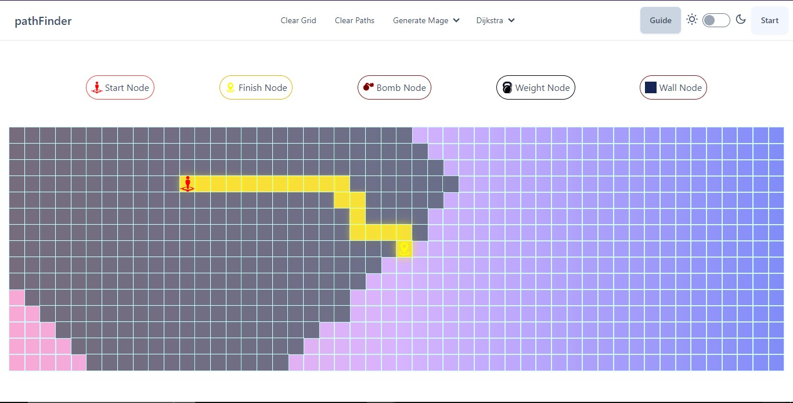

## PATH FINDER APP WITH NEXT JS 14
[](https://path-finder-next14.vercel.app/)

click on the image to see the [demo](https://path-finder-next14.vercel.app/)

##### This project is created using Nextjs14, Tailwind, DaisyUI, NodeV20

## Insall dependencies 

```bash
npm install 
#or 
pnpm install 
#or 
yarn install 
```

## Getting Started

First, run the development server:

```bash
npm run dev
# or
yarn dev
# or
pnpm dev
# or
bun dev
```
Open [http://localhost:3000](http://localhost:3000) with your browser to see the result.


